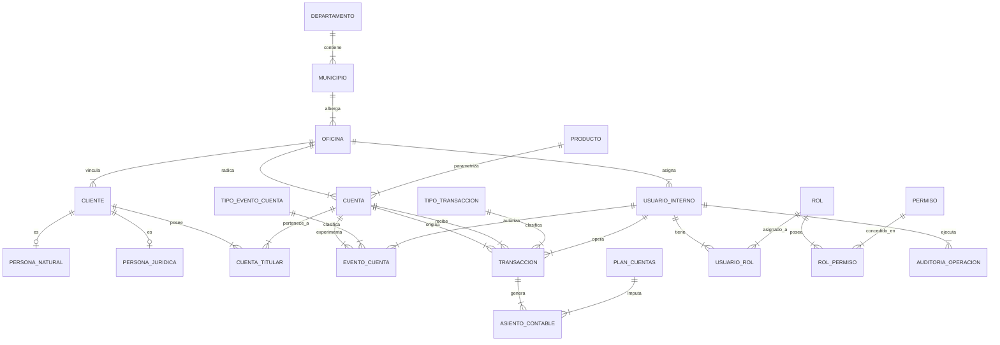

# TALLER BANCO ANDINO 
 
1. Ingeniaría del dominio con ia 
 
Solución de la IA: 
 
#### Fase 1: 
 
### Especificación Técnica de Ingeniería del Dominio: Banco Andino Colombia 
 
Como arquitecto de datos senior, DBA de PostgreSQL y especialista en sistemas bancarios OLTP, presento la especificación detallada del dominio para el núcleo transaccional de **Banco Andino Colombia**. El diseño está concebido para soportar un volumen objetivo de **10.000 clientes, 50.000 cuentas y 1.000.000 de transacciones financieras**, cumpliendo con normalización en 3FN y las reglas estrictas del sistema. 

### 1. Actores y Procesos 
 
#### Actores del Sistema 
 
1. **Cliente Persona Natural: Persona física vinculada al banco que actúa como titular, cotitular o firmante de productos financieros.** 
2. **Cliente Persona Jurídica: Entidad legal (empresa/institución) titular de cuentas empresariales, representada por uno o más apoderados legales.** 
3. **Usuario Interno (Empleado/Operador)**: Personal administrativo o de red de oficinas (cajeros, analistas, ejecutivos). **Diferenciado explícitamente del cliente**. 
4. **Analista de Riesgo / Cumplimiento**: Usuario interno con atribuciones para aplicar/levantar bloqueos administrativos o aprobar sobregiros. 
5. **Auditor Interno / Externo**: Usuario con acceso de solo lectura a la trazabilidad y logs inmutables de auditoría. 
6. **Sistema Batch / Motor Automático**: Proceso del sistema que ejecuta cierres diarios, liquidación de intereses, cobros de comisiones y generación de extractos. 

#### Procesos de Negocio 
 
- **Vinculación y Onboarding de Clientes**: Registro unificado de personas naturales o jurídicas con validación documental e identificación de ubicación geográfica (departamento/municipio/oficina). 
- **Ciclo de Vida de Cuenta (Eventos Administrativos)**: Apertura, asignación de titulares N:M, activación, cambio de límites, bloqueo preventivo/judicial, desbloqueo y cierre definitivo. 
- **Procesamiento de Transacciones Financieras (OLTP)**: Ejecución atómica de consignaciones, retiros, transferencias, débitos y créditos. 
- **Contabilización por Doble Partida (Ledger)**: Generación automática de asientos contables balanceados (sumatoria de Débitos = sumatoria de Créditos) por cada transacción procesada. 
- **Reverso y Compensación**: Corrección de transacciones inconsistentes o erróneas mediante operaciones compensatorias (preservando inmutabilidad). 
- **Auditoría y Seguridad (RBAC)**: Captura inmutable de quién, qué, cuándo y qué valores cambiaron en operaciones críticas. 

### 2. Entidades y Propósito 
 
| Dominio | Entidad | Propósito de Negocio | 
|---|---|---| 
| **Geografía** | departamento | Catálogo oficial DANE de departamentos de Colombia. | 
|  | municipio | Catálogo oficial DANE de municipios asociados a un departamento. | 
|  | oficina | Puntos de atención física del banco asociados a un municipio. | 
| **Clientes** | **cliente** | **Entidad base de identificación del cliente (código único, tipo y estado).** | 
|  | **persona_natural** | **Extensión con datos específicos de personas físicas (cédula, nombres, fecha nacimiento).** | 
|  | **persona_juridica** | **Extensión con datos de personas jurídicas (NIT, razón social, representante).** | 
| **Cuentas** | producto | Parámetros de productos financieros (Ahorros, Corriente, Nómina). | 
|  | cuenta | Registro del contrato financiero, moneda, estados, saldos y límites. | 
|  | cuenta_titular | Tabla asociativa N:M entre clientes y cuentas con tipo de relación. | 
| **Eventos** | tipo_evento_cuenta | Catálogo de tipos de eventos administrativos de ciclo de vida. | 
|  | evento_cuenta | Registro histórico inmutable de eventos de gestión sobre la cuenta. | 
| **Transacciones** | tipo_transaccion | Catálogo de operaciones financieras (consignación, retiro, transferencia, etc.). | 
|  | transaccion | Encabezado de la transacción financiera (monto, fecha, idempotency_key, estado). | 
| **Contabilidad** | plan_cuentas | Catálogo del Plan Único de Cuentas (PUC) bancario. | 
|  | asiento_contable | Registro en el ledger de partida doble (débito/crédito) por transacción. | 
| **Seguridad** | usuario_interno | Empleados del banco habilitados para operar el sistema (cliente ≠ usuario). | 
|  | rol | Roles de seguridad RBAC (Cajero, Analista, Auditor, Admin). | 
|  | permiso | Acciones y privilegios granulares del sistema. | 
|  | usuario_rol | Relación N:M de asignación de roles a usuarios internos. | 
|  | rol_permiso | Relación N:M de permisos asignados a cada rol. | 
| **Auditoría** | auditoria_operacion | Log central inmutable de cambios y operaciones críticas. | 

### 3. Atributos Esenciales 
 
- **departamento**: id_departamento (PK, INT), codigo_dane (VARCHAR(5), UNIQUE), nombre (VARCHAR(100)). 
- **municipio**: id_municipio (PK, INT), id_departamento (FK), codigo_dane (VARCHAR(5)), nombre (VARCHAR(100)). 
- **oficina**: id_oficina (PK, INT), id_municipio (FK), codigo_oficina (VARCHAR(10), UNIQUE), nombre (VARCHAR(100)), direccion (VARCHAR(200)). 
- **cliente**: id_cliente (PK, BIGINT), codigo_cliente (VARCHAR(20), UNIQUE), tipo_cliente (VARCHAR(10) CHECK: 'NATURAL', 'JURIDICA'), id_oficina_vinculacion (FK), estado (VARCHAR(20)), fecha_vinculacion (TIMESTAMPTZ). 
- **persona_natural: id_cliente (PK/FK), tipo_documento (VARCHAR(5)), numero_documento (VARCHAR(20), UNIQUE conjunto), primer_nombre (VARCHAR(50)), primer_apellido (VARCHAR(50)), fecha_nacimiento (DATE).** 
- **persona_juridica: id_cliente (PK/FK), nit (VARCHAR(20), UNIQUE), razon_social (VARCHAR(150)), representante_legal_id (FK a persona_natural).** 
- **producto**: id_producto (PK, INT), codigo_producto (VARCHAR(10), UNIQUE), nombre (VARCHAR(50)), tipo_producto (VARCHAR(20)). 
- **cuenta**: id_cuenta (PK, BIGINT), numero_cuenta (VARCHAR(20), UNIQUE), id_producto (FK), id_oficina_apertura (FK), moneda (VARCHAR(3) DEFAULT 'COP'), estado (VARCHAR(20)), saldo_disponible (NUMERIC(18,2)), saldo_canje (NUMERIC(18,2)), limite_sobregiro (NUMERIC(18,2)), fecha_apertura (TIMESTAMPTZ), fecha_cierre (TIMESTAMPTZ, NULLABLE). 
- **cuenta_titular**: id_cuenta (PK/FK), id_cliente (PK/FK), tipo_titularidad (VARCHAR(20) CHECK: 'PRINCIPAL', 'COTITULAR_CONJUNTO', 'COTITULAR_INDISTINTO', 'APODERADO'), porcentaje_participacion (NUMERIC(5,2)). 
- **evento_cuenta**: id_evento (PK, BIGINT), id_cuenta (FK), id_tipo_evento (FK), id_usuario_interno (FK), fecha_hora (TIMESTAMPTZ), motivo (TEXT), estado_anterior (VARCHAR(20)), estado_nuevo (VARCHAR(20)). 
- **transaccion**: id_transaccion (PK, BIGINT), idempotency_key (UUID, UNIQUE), id_cuenta_origen (FK, NULLABLE), id_cuenta_destino (FK, NULLABLE), id_tipo_transaccion (FK), monto (NUMERIC(18,2)), estado_transaccion (VARCHAR(20) CHECK: 'PENDING', 'POSTED', 'REJECTED', 'REVERSED'), fecha_transaccion (TIMESTAMPTZ), id_usuario_operador (FK, NULLABLE). 
- **asiento_contable**: id_asiento (PK, BIGINT), id_transaccion (FK), num_linea (INT), codigo_cuenta_puc (VARCHAR(20)), tipo_movimiento (VARCHAR(10) CHECK: 'DEBITO', 'CREDITO'), monto (NUMERIC(18,2)), fecha_contable (TIMESTAMPTZ). 
- **usuario_interno**: id_usuario (PK, INT), username (VARCHAR(50), UNIQUE), email (VARCHAR(100)), id_oficina (FK), activo (BOOLEAN). 
- **auditoria_operacion**: id_auditoria (PK, BIGINT), nombre_tabla (VARCHAR(50)), operacion (VARCHAR(10)), id_registro (BIGINT), id_usuario_interno (FK, NULLABLE), fecha_hora (TIMESTAMPTZ), datos_anteriores (JSONB), datos_nuevos (JSONB). 

### 4. Relaciones y Cardinalidades 
 
- **departamento 1 : N municipio (Un departamento contiene 1 o muchos municipios).** 
- **municipio 1 : N oficina (Un municipio alberga 0 o muchas oficinas bancarias).** 
- **oficina 1 : N cliente (Oficina de radicación/vinculación del cliente).** 
- **oficina 1 : N cuenta (Oficina donde se radicó la apertura de la cuenta).** 
- **cliente 1 : 1 (Exclusivo) persona_natural / persona_juridica (Especialización del cliente).** 
- **cliente N : M cuenta mediante cuenta_titular (Una cuenta puede tener múltiples titulares; un cliente puede poseer varias cuentas).** 
- **producto 1 : N cuenta (Un producto parametriza muchas cuentas).** 
- **cuenta 1 : N evento_cuenta (Una cuenta registra múltiples eventos de su ciclo de vida).** 
- **cuenta 1 : N transaccion (Como cuenta origen o cuenta destino).** 
- **transaccion 1 : N asiento_contable (Cada transacción genera mínimo 2 movimientos contables para cumplir doble partida).** 
- **plan_cuentas 1 : N asiento_contable (Imputación a la estructura PUC).** 
- **usuario_interno 1 : N evento_cuenta / transaccion (Operador que autoriza o ejecuta).** 
- **usuario_interno N : M rol vía usuario_rol.** 
- **rol N : M permiso vía rol_permiso.** 

### 5. Catálogos y Estados 
 
#### Matriz de Estados de Cuentas 
 
1. PENDIENTE_ACTIVACION: Cuenta creada, pendiente de fondeo inicial o verificación. 
2. ACTIVA: Opera con normalidad para todas las transacciones permitidas. 
3. BLOQUEADA_PARCIAL: Permite consignaciones/créditos, pero **impide retiros/débitos**. 
4. BLOQUEADA_TOTAL: Rechaza todo tipo de transacción financiera. 
5. INACTIVA: Sin movimientos por más de 6 meses; requiere reactivación administrativa. 
6. CERRADA: Estado terminal inmutable; saldo final debe ser estrictamente $0.00. 
 
#### Matriz de Estados de Transacciones Financieras 
 
1. PENDING: Recibida en la API/Canal, en proceso de validación y aplicación de locks. 
2. POSTED: Contabilizada e inmutable. Afecta el ledger y saldos definitivos. 
3. REJECTED: Rechazada por falta de fondos, validaciones de seguridad o regla de negocio. 
4. REVERSED: Estado marcado únicamente cuando una transacción POSTED ha sido corregida mediante una transacción compensatoria. 

### 6. Mínimo 30 Reglas de Negocio Verificables 
 
#### I. Clientes e Identidad 
 
1. **RN-01 (Unicidad Documental): El par (tipo_documento, numero_documento) en persona natural y nit en persona jurídica deben ser únicos a nivel nacional.** 
2. RN-02 (Exclusividad Subtipo Cliente): Un registro en cliente debe estar asociado estrictamente a una persona_natural o a una persona_juridica, jamás a ambas ni a ninguna. 
3. **RN-03 (Mayoría de Edad Titular Principal)**: El titular principal (TITULAR_PRINCIPAL) de una cuenta debe tener mínimo 18 años al momento de la apertura. 
4. **RN-04 (Representante Legal Activo): Toda persona jurídica requiere al menos un representante legal registrado como persona natural activa en el sistema.** 
5. **RN-05 (Separación Cliente / Usuario)**: Los clientes no forman parte del catálogo usuario_interno. Sus autenticaciones y accesos operativos están totalmente aislados. 
6. **RN-06 (Ubicación Geográfica Validad)**: Todo cliente y oficina debe estar vinculado a un municipio válido perteneciente al catálogo DANE oficial de Colombia. 
 
#### II. Cuentas y Titularidad 
 
7. **RN-07 (Número de Cuenta Único)**: El numero_cuenta es único a nivel nacional y sigue la estructura: [Código Oficina (3)]-[Código Producto (2)]-[Secuencial (10)]. 
8. **RN-08 (Titular Principal Obligatorio)**: Toda cuenta debe tener exactamente un titular con tipo de titularidad PRINCIPAL en cuenta_titular. 
9. **RN-09 (Límite de Cotitulares)**: Una cuenta puede registrar máximo 5 cotitulares o apoderados activos. 
10. **RN-10 (Participación Contable)**: La suma de los porcentajes de participación en cuenta_titular debe sumar exactamente 100.00%. 
11. **RN-11 (Saldo No Negativo en Ahorros)**: El saldo_disponible en cuentas de ahorros y nómina debe ser mayor o igual a 0.00 COP. 
12. **RN-12 (Límite de Sobregiro en Cuentas Corrientes)**: En cuentas corrientes, el saldo_disponible no puede caer por debajo de -limite_sobregiro aprobado. 
13. **RN-13 (Moneda Única)**: Todas las operaciones de una cuenta deben procesarse en la moneda oficial parametrizada (COP). 

#### III. Eventos Administrativos (Ciclo de Vida) 
 
14. **RN-14 (Aislamiento Financiero de Eventos)**: Los eventos administrativos se registran en evento_cuenta y **no generan asientos contables**. 
15. **RN-15 (Trazabilidad de Operador en Eventos)**: Todo evento administrativo debe registrar obligatoriamente el id_usuario_interno y un motivo textual mayor o igual a 10 caracteres. 
16. **RN-16 (Condición para Cierre de Cuenta)**: Una cuenta solo puede ser cambiada a estado CERRADA si su saldo_disponible = 0.00 y saldo_canje = 0.00. 
17. **RN-17 (Transición Válida de Estados)**: Las cuentas no pueden saltar a estados no autorizados. 
 
#### IV. Transacciones Financieras e Inmutabilidad 
 
18. **RN-18 (Inmutabilidad de POSTED)**: Registros en transaccion con estado POSTED tienen prohibida cualquier operación UPDATE o DELETE. 
19. **RN-19 (Idempotencia Financiera)**: Toda transacción debe enviar un idempotency_key único (UUIDv4). 
20. **RN-20 (Aislamiento Origen/Destino)**: En transferencias entre cuentas, id_cuenta_origen debe ser diferente de id_cuenta_destino. 
21. **RN-21 (Validación de Estado Activo para Débitos)**: Solo se ejecutan débitos/retiros si la cuenta origen está en estado ACTIVA. 
22. **RN-22 (Restricción de Bloqueo Parcial)**: Una cuenta en BLOQUEADA_PARCIAL permite consignaciones, pero rechaza retiros. 
23. **RN-23 (Corrección Exclusiva por Reverso)**: Toda corrección financiera se realiza mediante una nueva transacción de tipo REVERSO. 
24. **RN-24 (Secuencia Temporal Validad)**: La fecha de transacción debe ser posterior a la fecha_apertura de la cuenta involucrada. 

#### V. Contabilidad por Doble Partida 
 
25. **RN-25 (Equilibrio Contable OBLIGATORIO)**: Para toda transacción POSTED, la suma de débitos debe ser igual a la suma de créditos dentro de asiento_contable. 
26. **RN-26 (Sincronización de Saldo con Ledger)**: El saldo_disponible de la cuenta debe coincidir exactamente con la suma algebraica de sus asientos contables aplicados. 
27. **RN-27 (Atomicità de Asientos)**: La transacción y sus movimientos de doble partida deben insertarse en un único bloque de transacción ACID (BEGIN...COMMIT). 
 
#### VI. Seguridad, RBAC y Auditoría 
 
28. **RN-28 (Mínimo Privilegio Operativo)**: Los usuarios con rol CAJERO no poseen permisos DDL ni autorización para modificar limite_sobregiro o ejecutar desbloqueos de cuentas. 
29. **RN-29 (Auditoría de Cambios Sensibles)**: Cambios en tablas maestras deben generar automáticamente un registro inmutable en auditoria_operacion. 
30. **RN-30 (Prohibición de Borrado Físico)**: Ninguna tabla crítica permite sentencias DELETE. 
31. **RN-31 (No Tipos Flotantes)**: Ningún atributo monetario utilizará FLOAT o REAL. Se usará NUMERIC(18,2). 
32. **RN-32 (Horario Operativo)**: Transacciones ejecutadas en oficina por CAJERO deben registrar la estampa TIMESTAMPTZ correspondiente a la jornada habilitada. 

### 7. Riesgos de Consistencia 
 
1. **Carrera de Condición (Race Condition) / Doble Retiro Concurrente**: 
   - *Riesgo*: Dos peticiones simultáneas sobre una cuenta con $100.000 intentan retirar $80.000 al mismo tiempo. 
   - *Mitigación PostgreSQL*: Control de concurrencia pesimista mediante SELECT ... FOR UPDATE o niveles de aislamiento REPEATABLE READ / SERIALIZABLE. 
 
2. **Inconsistencia de Partida Doble por Fallo Parcial**: 
   - *Riesgo*: La transacción inserta el registro financiero pero falla al escribir las líneas en el ledger contable. 
   - *Mitigación PostgreSQL*: Encapsulamiento total en Stored Procedures/Triggers con validación de balance antes del COMMIT final. 
 
3. **Violación Directa de Inmutabilidad por Usuarios Administradores**: 
   - *Riesgo*: Un DBA ejecuta un UPDATE manual sobre una transacción o asiento ya publicado. 
   - *Mitigación PostgreSQL*: Triggers de inmutabilidad BEFORE UPDATE OR DELETE y revocación de privilegios UPDATE/DELETE. 
 
4. **Hotspots y Contención de Bloqueos en Cuentas Concentradoras**: 
   - *Riesgo*: Cuentas de alto tráfico sufren latencia extrema por bloqueos constantes fila a fila. 
   - *Mitigación PostgreSQL*: Separación de escrituras en ledger diferido y reconciliación asíncrona de saldo persistido. 

### 8. Decisiones que Requieren Validación Humana (Reglas ambiguas) 
 
1. **Estrategia de Modelado de Clientes (Herencia vs Tablas de Extensión)**: 
   - **Decisión**: Se optó por una tabla base cliente con extensiones 1:1 (persona_natural y persona_juridica). 
 
2. **Almacenamiento de Saldos (Saldo Persistido vs Calculado al Vuelo)**: 
   - *Decisión*: Se definió mantener saldo_disponible persistido en cuenta por motivos de rendimiento OLTP. 
 
3. **Identificación Primaria (UUID vs BIGINT Identity)**: 
   - *Decisión*: Usar BIGINT GENERATED ALWAYS AS IDENTITY para PKs internas y reservar UUID para idempotency_key. 
 
4. **Manejo de Sobregiros y Tasas de Interés**: 
   - *Decisión*: Se sugiere proceso batch para no sobrecargar el thread OLTP. 

### 9. Diagrama ERD (Mermaid) 
 

### 10. Autocrítica Técnica 
 
#### Sobrediseñado (Over-designed) 
 
- **Estructura completa de RBAC integrada en la base de datos**: Diseñar tablas explícitas de usuario_interno, rol, permiso, usuario_rol y rol_permiso directamente en la base de datos relacional puede resultar redundante si la aplicación utiliza un Identity Provider moderno. 
 
#### Subdiseñado (Under-underdesigned) 
 
- **Particionamiento de Auditoría y Transacciones**: No se ha definido aún una estrategia explícita de **particionamiento por rango de fechas (PARTITION BY RANGE (fecha_transaccion))**. 
- **Mapeo de Redes de Pago Externas**: Falta enriquecer la entidad transaccion con campos para compensación interbancaria. 
 
#### Ambiguo 
 
- **Validación de Firmas en Titularidades Conjuntas**: No se define si la BD debe bloquear la transacción hasta recibir N autorizaciones o si la regla se delegará a la capa de aplicación. 
 
Este diseño inicial sirve como la especificación técnica completa y validada para avanzar hacia la **Fase 2: Modelo Lógico y Físico** y la generación del código DDL profesional en PostgreSQL. 

## Deciciones ambiguas corregidas 
 
Las cuatro decisiones de arquitectura que requerían validación humana han quedado oficialmente definidas y cerradas. 
 
A continuación, presento la versión actualizada de la **Sección 8: Decisiones de Arquitectura Validadas**, consolidando la justificación técnica de cada elección según los estándares exigidos para **Banco Andino Colombia**: 
 
### 8. Decisiones de Arquitectura Validadas (Cerradas) 
 
1. **Estrategia de Modelado de Clientes (Tablas de Extensión Normalizadas)** 
   - **Decisión Final**: Se confirma la arquitectura de tablas de extensión en 3FN con la tabla base cliente y relaciones 1:1 exclusivas hacia persona_natural y persona_juridica. 
   - **Justificación Técnica**: Evita columnas nulas masivas y mantiene la atomicidad de datos mediante constraints explícitas. 
 
2. **Almacenamiento y Reconciliación de Saldos (Saldo Persistido + Ledger)** 
   - **Decisión Final**: Se aprueba mantener saldo_disponible persistido en cuenta para la operación OLTP, respaldado por un proceso batch nocturno de reconciliación contra el ledger. 
   - **Justificación Técnica**: Previene la degradación en tiempos de respuesta al evitar consultas agregadas costosas sobre el histórico de transacciones. 
 
3. **Estrategia de Claves Primarias e Identidad (BIGINT vs UUID)** 
   - **Decisión Final**: Se adopta BIGINT GENERATED ALWAYS AS IDENTITY para todas las PKs internas y UUID para idempotency_key y referencias externas. 
   - **Justificación Técnica**: Optimiza memoria, acelera índices B-Tree y garantiza idempotencia sin penalizar la estructura interna. 
 
4. **Manejo de Sobregiros y Cálculo de Intereses (Proceso Batch Nocturno)** 
   - **Decisión Final**: El cálculo e imputación de intereses por sobregiro se procesará mediante un **job batch automatizado a medianoche**. 
   - **Justificación Técnica**: Mantiene baja latencia en transacciones en tiempo real y centraliza los débitos por intereses en un cierre contable diario. 
 
Con estas decisiones cerradas, la especificación técnica del dominio (Fase 1) está **100% completada y alineada con los Quality Gates**. 

 